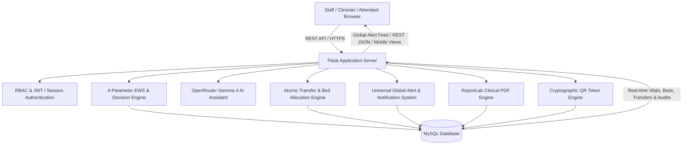

# Jeevan Setu 🏥
### Intelligent ICU ↔ HDU Patient Transfer Decision Support, Clinical Reasoning & Attendant Access System

[](https://www.python.org/)
[](https://flask.palletsprojects.com/)
[](https://www.mysql.com/)
[](LICENSE)
[]()

---

## 📌 Executive Summary

**Jeevan Setu** (*Bridge of Life*) is an enterprise-grade hospital clinical decision support system (CDSS) designed to streamline critical care bed workflows, patient deterioration tracking, and ICU ↔ HDU (High Dependency Unit) step-down transfers. 

The platform integrates:
1. **Real-Time 4-Parameter Early Warning Scoring (EWS)** for continuous vital signs telemetry.
2. **AI-Powered Clinical Decision Support & Reasoning** leveraging OpenRouter & Google Gemma 4 AI for interactive clinician querying and automated patient summaries.
3. **Atomic Transfer Approval Pipeline** with concurrency-safe HDU bed assignment and instant ICU bed release.
4. **Strict Doctor-Patient Authorization & IDOR Hardening** ensuring clinicians only receive alerts and access records for assigned patients.
5. **Universal Global Alert & Notification System** with real-time popups across Doctor, Nurse, and Attendant portals.
6. **Permanent QR Attendant Access System** providing families with secure, read-only mobile recovery updates.

---

## 🌟 Key Features & Capabilities

### 🩺 1. Clinical Decision Support & 4-Parameter EWS Engine
- **Vital Parameters Tracked**:
  - Respiratory Rate ($RR$)
  - Heart Rate ($HR$)
  - Systolic Blood Pressure ($SBP$)
  - Body Temperature ($Temp$)
- **Automated Risk Stratification**: Sub-score calculations categorizing risk into `NORMAL`, `LOW`, `MEDIUM`, `HIGH`, and `CRITICAL`.
- **Transparent Step-Down Heuristics**: Automatic evaluation of patient readiness for step-down transfers (*Maintain in ICU*, *Transfer to HDU*, *Discharge / Ward*).

---

### 🤖 2. Jeevan Setu AI Clinical Assistant (OpenRouter & Gemma 4)
- **High-Performance AI Model**: Powered by OpenRouter integration (`google/gemma-4-31b-it:free`).
- **Context-Grounded Clinical Reasoning (CCRL)**:
  - Validates clinician queries against live database telemetry.
  - Generates comprehensive structured patient summaries (demographics, EWS trajectory, organ system review, medication history, and step-down eligibility).
  - Handles general medical consultations, drug-drug interaction inquiries, and discharge criteria.
- **Strict Role-Based Scoping**: Physicians access deep clinical reasoning while nursing staff receive monitoring guidance.

---

### 🛡️ 3. Doctor-Patient Authorization & IDOR Hardening
- **Strict Database-Level Scoping**: Queries for alerts, feeds, vitals, patient lists, reports, and transfers are strictly bound to `patients.assigned_doctor = authenticated_doctor_id`.
- **Zero Frontend Filtering Vulnerabilities**: Unauthorized patient data is never sent to the client browser.
- **Cross-Doctor IDOR Protection**: Direct API access to unassigned patient records, vitals, reports, or transfer actions immediately returns `HTTP 403 Forbidden` and logs a security audit event (`UNAUTHORIZED_PATIENT_ACCESS_ATTEMPT`).

---

### ⚡ 4. Atomic Transfer Approval & HDU Bed Allocation Pipeline
```
[Patient Stabilized (EWS=0)]
           │
           ▼
[Doctor Reviews & Approves Transfer]
           │
           ▼ (ACID Database Transaction)
   ┌────────────────────────────────────────────────────────┐
   │ 1. Lock transfer and patient records                   │
   │ 2. Select & lock available HDU bed (SELECT FOR UPDATE) │
   │ 3. Release previous ICU bed (status -> 'available')    │
   │ 4. Occupy target HDU bed (status -> 'occupied')        │
   │ 5. Update patient location: Ward -> HDU, Bed -> HDU-XX │
   │ 6. Update transfer record: status -> 'approved'        │
   │ 7. Deactivate pending transfer alerts                  │
   │ 8. Generate persistent nurse notification              │
   │ 9. Record audit trail entry                            │
   └────────────────────────────────────────────────────────┘
           │
           ├──────────────────────────────┬──────────────────────────────┐
           ▼                              ▼                              ▼
 [Nurse Portal Popup]          [Attendant Portal View]          [Chatbot Telemetry]
 Real-time "TRANSFER APPROVED"    Instantly shows Ward: HDU,     Reports current location
 modal with assigned bed          Bed: <new_bed_number>          as HDU and new bed
```
- **Concurrency & Resource Safety**: Concurrency-safe bed selection with row-level locking (`FOR UPDATE`) prevents double bed allocation.
- **Full Rollback Guarantee**: If all HDU beds are occupied, the transaction rolls back cleanly, preserving patient and ICU bed states.
- **Multi-Portal Real-Time Consistency**: Doctor, Nurse, Admin, Attendant, and Chatbot immediately read the updated HDU location from the database.

---

### 🔔 5. Global Alert & Notification System
- **Universal Modal Popups**: Overlay notifications display across all pages without requiring dashboard reloads:
  - 🚨 **Critical Emergency Alerts**: Triggered on vital sign deterioration ($EWS \ge 7$ or single parameter deterioration).
  - ⏳ **Prolonged Ready-to-Transfer Alerts**: Alerts clinicians when stable patients exceed ward waiting thresholds.
  - ✅ **Transfer Approved Notifications**: Alerts assigned nurses immediately upon doctor approval with destination bed details.
- **Role Guardrails**:
  - **Doctor**: `[Dismiss]`, `[Review]`, and `[Approve Transfer]`.
  - **Nurse**: `[Dismiss]` and `[Review]` (**Strictly prohibited from approving transfers**).

---

### 📱 6. Permanent Patient-Specific QR Attendant Access
- **Cryptographically Secure Tokens**: Opaque tokens (`JS-QR-P{patient_id}-{entropy}`) without exposed PII in URLs.
- **One Permanent QR per Patient**: Static QR badges for hospital beds and ID passes until discharged or revoked.
- **Mobile Read-Only Dashboard**: Allows family attendants to view real-time recovery progress, vital signs, assigned ward, and clinician details on their mobile devices.

---

## 🏛️ System Architecture



---

## 👥 User Roles & Login Credentials

| Role | Username | Password | Full Name | Department / Ward |
| :--- | :--- | :--- | :--- | :--- |
| **🛡️ Admin** | `admin` | `Admin@123` / `admin123` | System Administrator | Administration |
| **👨‍⚕️ Doctor** | `dr_sharma` | `Doctor@123` / `doctor123` | Dr. Rajesh Sharma | ICU |
| **👨‍⚕️ Doctor** | `dr_gupta` | `Doctor@123` / `doctor123` | Dr. Ananya Gupta | Cardiology |
| **👨‍⚕️ Doctor** | `dr_patel` | `Doctor@123` / `doctor123` | Dr. Kavita Patel | Medicine |
| **👩‍⚕️ Nurse** | `nurse_priya` | `Nurse@123` / `nurse123` | Sr. Nurse Priya Patel | ICU |
| **👩‍⚕️ Nurse** | `nurse_arun` | `Nurse@123` / `nurse123` | Nurse Arun Krishnan | HDU |
| **👩‍⚕️ Nurse** | `nurse_meera` | `Nurse@123` / `nurse123` | Nurse Meera Jain | ICU |
| **📱 Attendant** | `att_rajesh` | `Attendant@123` | Suman Kumar | Family Attendant |

---

## 📂 Project Structure

```
Jeevan-Setu/
├── JEEVAN_SETU/                  # Flask Backend Application
│   ├── app.py                   # Application entrypoint & blueprint router
│   ├── config.py                # Hospital branding, waiting thresholds & MySQL config
│   ├── requirements.txt         # Python backend dependencies
│   ├── database/                # Schema definitions & migrations
│   │   ├── schema.sql           # Database tables schema
│   │   ├── init_db.py           # DB initializer & seed data
│   │   └── migration_manager.py # SQL migration runner
│   ├── models/                  # Data models (Patient, Vitals, EWS, Alert, Transfer, Bed, User, QRToken)
│   ├── modules/                 # Decision engine, Scoring engine, Alert engine, Chatbot engine
│   ├── routes/                  # REST API Blueprints (Alert, Transfer, Patient, Vitals, Bed, Attendant, Chatbot, Report)
│   ├── services/                # Business services (Auth, Notification, Decision, Realtime)
│   ├── utils/                   # RBAC middleware, JWT handlers, security decorators, audit logging
│   └── tests/                   # Comprehensive automated test suites
│
├── Jeevan_setu_frontend/        # Frontend Templates & Assets
│   ├── Admin/                   # Administrator portals (Patient & Bed management, QR generation)
│   ├── Doctor/                  # Physician portals (My Patients, Pending Approvals, Transfer Reports)
│   ├── Nurse/                   # Nursing portals (Dashboard, Enter Vitals, My Patients, Alerts)
│   ├── Attendant/               # Mobile QR scan entry & patient replica dashboard
│   ├── Login/                   # Multi-role authentication interface
│   └── global_alert_manager.js  # Universal Global Alert System client script
│
├── .gitignore                   # Git ignore configuration
└── README.md                    # Project documentation
```

---

## 🚀 Quick Start Guide

### 1. Prerequisites
- **Python 3.10+**
- **MySQL 8.0+**
- **Git**

---

### 2. Clone the Repository
```bash
git clone https://github.com/Thanush505/Jeevan-Setu.git
cd Jeevan-Setu
```

---

### 3. Setup Virtual Environment
```bash
# Windows
python -m venv .venv
.venv\Scripts\activate

# macOS / Linux
python3 -m venv .venv
source .venv/bin/activate
```

---

### 4. Install Dependencies
```bash
cd JEEVAN_SETU
pip install -r requirements.txt
```

---

### 5. Configure Environment Variables
Create `.env` inside `JEEVAN_SETU/`:
```env
DB_HOST=127.0.0.1
DB_PORT=3306
DB_USER=root
DB_PASSWORD=your_mysql_password
DB_NAME=jeevan_setu
SECRET_KEY=your_secret_key
JWT_SECRET_KEY=your_jwt_secret_key
OPENROUTER_API_KEY=your_openrouter_api_key
OPENROUTER_MODEL=google/gemma-4-31b-it:free
```

Initialize database tables and seed clinician logins:
```bash
python database/init_db.py
```

---

### 6. Run the Application
```bash
python app.py
```
- **Web Portal Access**: `http://127.0.0.1:5000`
- **Mobile Access (Same Wi-Fi)**: `http://<YOUR_LAN_IP>:5000`

---

## 🧪 Testing & Verification

Run automated test suites verifying authorization, atomic transfers, EWS scoring, and AI reasoning:
```bash
# Verify Doctor-Patient Authorization & IDOR protection
python ../test_auth_suite.py

# Verify Complete Atomic Transfer Workflow (ICU -> HDU -> Bed Allocation -> Nurse Notification)
python ../test_transfer_workflow.py

# Verify Rollback Behavior under zero bed availability
python ../test_rollback.py
```

---

## 📄 License

This project is licensed under the MIT License — see the [LICENSE](LICENSE) file for details.

---

## 👨‍💻 Author & Acknowledgments

- **Lead Developer**: [Thanush505](https://github.com/Thanush505)
- Developed as part of the Major Project Initiative for **Jeevan Setu — Intelligent ICU ↔ HDU Clinical Decision Support System**.
