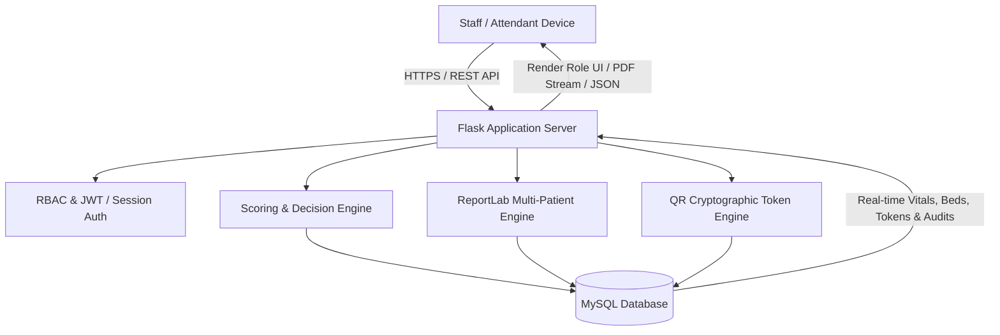

# JEEVAN SETU (जीवन सेतु) 🏥

[](https://python.org)
[](https://flask.palletsprojects.com/)
[](https://www.mysql.com/)
[](https://tailwindcss.com/)
[](LICENSE)

> **Intelligent Clinical Decision Support & Critical Care Patient Transfer System (ICU ↔ HDU)**

---

## 📌 Overview

**Jeevan Setu** is an intelligent, secure, and explainable clinical decision-support and critical care operations platform designed to optimize patient monitoring and transfers between **Intensive Care Units (ICU)**, **High Dependency Units (HDU)**, and General Wards.

By integrating continuous vital signs monitoring, automated **Early Warning Score (EWS)** calculation, explainable AI-driven clinical heuristics, permanent patient-specific QR attendant portals, and multi-patient ReportLab clinical reporting, Jeevan Setu empowers healthcare teams with real-time operational telemetry and objective decision support.

---

## ✨ Key Capabilities & Modules

### 🛡️ 1. Fully Integrated Administrator Portal
- **Dashboard & Real-Time Telemetry**: Live hospital census, active ICU/HDU bed occupancy, pending transfer requests, and critical patient alerts.
- **Patient Management & In-App Admission**: Real-time admission modal connected to MySQL (`UHID`, demographics, diagnosis, bed allocation, and clinician assignment).
- **Consolidated Beds, Wards & Resource Utilization**:
  - Live spatial bed matrix for ICU-A, HDU-B, and General Ward-C.
  - Overall bed occupancy %, critical care load pressure, and available intake capacity.
  - Ward-by-ward capacity directory with automated alerts for wards exceeding $85\%$ capacity.
- **User & Role Management**: Add clinicians/administrators directly to MySQL with hashed passwords and granular permissions.
- **Permanent Patient-Specific QR Attendant Access Management**:
  - Cryptographically secure opaque tokens (`JS-QR-P{patient_id}-{entropy}`).
  - Static QR persistence (one permanent QR per patient until revoked or regenerated).
  - High-resolution printable hospital badge passes and PNG downloads.
  - Instant revocation and regeneration controls.
- **Multi-Patient Clinical Reports**:
  - ReportLab two-pass repeating hospital header canvas on every PDF page.
  - Interactive multi-patient batching, real-time structured previews, and dynamic downloads.
- **Audit Logs, System Settings & Backup**: Real-time audit trails tracking authentication, transfers, clinical reports, and QR scans.

---

### 📱 2. Permanent Patient QR & Mobile Attendant Portal
```
ADMIN                                          ATTENDANT
  │                                                │
  ▼                                                ▼
Generate QR (Once per patient)               Scan QR Code
  │                                                │
  ▼                                                ▼
Permanent Secure Token ────────────► Mobile Scan Entry Page
(Zero sensitive PII in QR)           (Enter Attendant Name)
                                                   │
                                                   ▼
                                        Verify Token & Name
                                                   │
                                                   ▼
                                        Create Attendant Session
                                                   │
                                                   ▼
                                      Read-Only Patient Dashboard
                                      (Vitals, EWS, Bed & Clinician)
```
- **Mobile-First Entry Page** (`/Attendant/attendant_access.html`): Minimal context badge, name sanitization, and server-side validation.
- **Strict Isolation**: Read-only clinical telemetry dynamically bound to the authenticated attendant session.

---

### 🩺 3. Clinical Decision Support & EWS Engine
- **Standard 4-Parameter Vital Assessment**:
  - Respiratory Rate ($RR$)
  - Heart Rate ($HR$)
  - Systolic Blood Pressure ($SBP$)
  - Body Temperature ($Temp$)
- **Automated Real-Time EWS Scoring**: Calculates sub-scores per parameter and categorizes risk (`NORMAL`, `LOW`, `MEDIUM`, `HIGH`, `CRITICAL`).
- **Explainable Decision Recommendations**: Evaluates condition indicators and outputs transparent clinical recommendations (*Keep in ICU*, *Transfer to HDU*, *Discharge / Ward*).

---

### 👥 4. Multi-Role RBAC & Security Architecture

| Role | Primary Dashboard & Capabilities |
| :--- | :--- |
| **🛡️ Administrator** | Full hospital operations, beds/wards, user creation, permanent QR passes, clinical reports, audit logs. |
| **👨‍⚕️ Attending Doctor** | Patient list, clinical summaries, transfer approvals, historical vital trends, diagnosis updates. |
| **👩‍⚕️ Staff Nurse** | Real-time vital entry, live ICU patient monitoring cards, medication logs, shift notes. |
| **📱 Patient Attendant** | Mobile QR scan portal with live read-only recovery status and vital signs. |

---

## 🏛️ System Architecture



---

## 📂 Project Structure

```
JSA-1/
├── JEEVAN_SETU/                  # Flask Backend Application
│   ├── app.py                   # Application entrypoint & dynamic router
│   ├── config.py                # Hospital branding & MySQL config
│   ├── requirements.txt         # Python dependencies
│   ├── database/                # Schema definitions & initializer
│   │   ├── schema.sql           # Database schema tables
│   │   ├── init_db.py           # DB initializer & default seed data
│   │   └── migration_manager.py # SQL migration runner
│   ├── models/                  # Data models (Patient, Vitals, EWS, User, Bed, QRToken, Report, etc.)
│   ├── modules/                 # Decision engine, report engine & analytics
│   ├── routes/                  # REST API Blueprints (Auth, Patient, Vitals, Bed, Attendant, Report, User)
│   ├── utils/                   # RBAC decorators, security helpers, validators
│   └── tests/                   # Comprehensive unit & integration test suites
│
├── Jeevan_setu_frontend/        # Frontend Templates & Assets
│   ├── Admin/                   # 11 Administrator management pages & admin_navigation.js
│   │   ├── Administrator_dashboard_/
│   │   ├── Admin_patient_management/
│   │   ├── Admin_beds_wards/     # Merged Beds, Wards & Resource Utilization
│   │   ├── Admin_users_roles/
│   │   ├── Admin_attendant_access/
│   │   ├── Admin_clinical_reports/
│   │   ├── Admin_ews_analytics/
│   │   ├── Admin_audit_logs/
│   │   ├── Admin_system_settings/
│   │   ├── Admin_notification_settings/
│   │   ├── Admin_backup_restore/
│   │   └── admin_navigation.js  # Single source of truth navigation
│   ├── Doctor/                  # Physician decision & review views
│   ├── Nurse/                   # Nursing vitals & monitoring views
│   ├── Attendant/               # Mobile QR scan entry & patient replica view
│   └── Login/                   # Multi-role authentication interface
│
├── .gitignore                   # Workspace git ignore configuration
├── README.md                    # Project documentation
└── run.md                       # Run commands & testing instructions
```

---

## 🚀 Quick Start Guide

### 1. Prerequisites
- **Python 3.10+**
- **MySQL 8.0+**
- **Git**

---

### 2. Clone the Repository
```bash
git clone https://github.com/Thanush505/Jeevan-Setu.git
cd Jeevan-Setu
```

---

### 3. Setup Virtual Environment
```bash
# Windows
python -m venv .venv
.venv\Scripts\activate

# macOS / Linux
python3 -m venv .venv
source .venv/bin/activate
```

---

### 4. Install Dependencies
```bash
cd JEEVAN_SETU
pip install -r requirements.txt
```

---

### 5. Configure Database Environment
Create or verify `JEEVAN_SETU/.env`:
```env
DB_HOST=127.0.0.1
DB_PORT=3306
DB_USER=root
DB_PASSWORD=your_mysql_password
DB_NAME=jeevan_setu
SECRET_KEY=your_secret_key
JWT_SECRET_KEY=your_jwt_secret_key
```

Initialize database tables and seed test data:
```bash
python database/init_db.py
```

---

### 6. Run the Application
```bash
python app.py
```
- **PC Access**: `http://127.0.0.1:5000`
- **Mobile Access (Same Wi-Fi)**: `http://192.168.1.3:5000`
- **Detailed Mobile Guide**: See [Attende access.md](file:///d:/Major_Project/JSA-1/Attende%20access.md)

---

## 📱 Mobile Attendant Portal & QR Access
- **Mobile URL**: `http://192.168.1.3:5000/Attendant/attendant_access.html`
- **Workflow**:
  1. Admin generates Patient QR badge on PC (`/Admin/Admin_attendant_access/...`).
  2. Family attendant scans QR badge with smartphone camera over local Wi-Fi.
  3. Phone validates token and opens real-time read-only patient recovery monitor.
- **Full Guide & Firewall Setup**: Read **[Attende access.md](file:///d:/Major_Project/JSA-1/Attende%20access.md)**.

---

## 🔑 Demo Login Credentials

| Role | Username | Password | Default Dashboard |
| :--- | :--- | :--- | :--- |
| **🛡️ Admin** | `admin` | `admin123` / `Admin@123` | `/Admin/Administrator_dashboard_/Administrator_dashboard_.html` |
| **👨‍⚕️ Doctor** | `doctor` / `dr_sharma` | `doctor123` / `Doctor@123` | `/Doctor/Doctor_dashboard_/Doctor_dashboard_.html` |
| **👩‍⚕️ Nurse** | `nurse` / `nurse_priya` | `nurse123` / `Nurse@123` | `/Nurse/Nurse_dashboard/Nurse_dashboard.html` |
| **📱 Attendant** | Direct QR Token / Scan | `N/A` | `http://192.168.1.3:5000/Attendant/attendant_access.html?token=<token>` |

---

## 🧪 Testing & Verification Suites

Run the automated verification scripts:
```bash
# Run all unit and integration test suites
pytest tests/ -v

# Run Permanent Patient QR Attendant Access end-to-end tests (10/10 PASS)
python scratch/test_attendant_qr_lifecycle.py

# Run Admin Navigation & Merged Pages audit
python scratch/test_admin_navigation.py

# Run Multi-Patient PDF report tests
pytest tests/test_patient_pdf_report.py -v
```

---

## 📄 License

This project is licensed under the MIT License — see the [LICENSE](LICENSE) file for details.

---

## 👨‍💻 Author & Acknowledgments

- **Lead Developer**: [Thanush505](https://github.com/Thanush505)
- Developed as part of the Major Project Initiative for **Jeevan Setu — Intelligent ICU ↔ HDU Clinical Decision Support System**.
