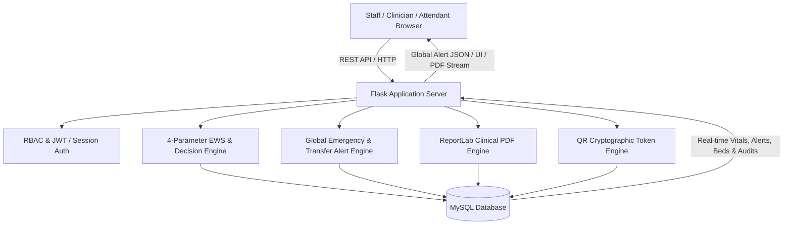

# JEEVAN SETU (जीवन सेतु) 🏥

[](https://python.org)
[](https://flask.palletsprojects.com/)
[](https://www.mysql.com/)
[](https://developer.mozilla.org/en-US/docs/Web/JavaScript)
[](LICENSE)

> **Intelligent Clinical Decision Support, Critical Emergency Alert & Patient Transfer System (ICU ↔ HDU)**

---

## 📌 Overview

**Jeevan Setu** is an intelligent, secure, and explainable clinical decision-support and hospital operations platform designed to optimize critical care monitoring and patient transfers between **Intensive Care Units (ICU)**, **High Dependency Units (HDU)**, and General Wards.

By integrating continuous vital signs monitoring, automated **Early Warning Score (EWS)** calculation, explainable clinical heuristics, **Global Universal Emergency Alerting**, prolonged **Ready-to-Transfer Monitoring**, permanent patient-specific QR attendant portals, and multi-patient ReportLab clinical reporting, Jeevan Setu empowers clinical teams with real-time operational telemetry and objective decision support.

---

## ✨ Key Capabilities & Modules

### 🚨 1. Global Emergency Alert System
- **Real-Time Critical Detection**: Automatically detects when a patient's vitals trigger a **Critical** risk level ($\text{EWS} \ge 5$ or critical vital deviations).
- **Universal Global Popup**: Dispatches instant emergency alert popups across **all 14 Doctor pages and 13 Nurse pages** without requiring users to navigate back to the dashboard.
- **Smart Queue & Zero-Dependency Modal**: Self-contained CSS modal with audio-visual indicators, vitals telemetry, patient UHID/bed info, and one-click clinical navigation.
- **Duplicate Prevention**: Intelligently suppresses duplicate alerts while an active alert is unacknowledged for the same patient.
- **Clinical Recovery Auto-Resolution**: Automatically marks critical alerts resolved when the patient's condition improves to Stable/Moderate.
- **Doctor Acknowledgment**: Tracks and persists clinician acknowledgment timestamps and user IDs in MySQL.

---

### 🔄 2. Prolonged Ready-to-Transfer Alert System
- **Automatic Prolonged Transfer Detection**: Monitors patients in *Ready-to-Transfer* state (*Fit for HDU Transfer*); generates high-priority alerts when waiting time exceeds the configurable threshold (default: 120 minutes).
- **Doctor-Only Transfer Approval**: Only Attending Doctors and Administrators have authorization to approve transfers.
- **Strict Nurse RBAC Enforcement**: Nurse portal displays read-only transfer status. Any attempt by unauthorized roles to approve a transfer is blocked with **HTTP 403 Forbidden** and recorded in the security audit log (`UNAUTHORIZED_TRANSFER_APPROVAL_ATTEMPT`).
- **Stale Approval Protection**: Re-evaluates patient vitals in real-time at the exact moment of approval; if the patient's condition has deteriorated and is no longer Stable, approval is rejected (**HTTP 400 Bad Request**).
- **Post-Approval Nurse Notifications**: Dispatches immediate notifications to ward nurses upon doctor approval to initiate physical bed transfer.

---

### 🛡️ 3. Administrator Portal
- **Real-Time Telemetry**: Live hospital census, active ICU/HDU bed occupancy, pending transfer requests, and critical alerts.
- **Patient Management & In-App Admission**: Real-time admission modal connected to MySQL (`UHID`, demographics, diagnosis, bed allocation, and clinician assignment).
- **Beds, Wards & Resource Utilization**:
  - Live spatial bed matrix for ICU-A, HDU-B, and General Ward-C.
  - Overall occupancy %, critical care load pressure, and capacity alerts for wards exceeding $85\%$ capacity.
- **User & Role Management**: Clinician accounts with bcrypt/werkzeug hashed passwords and granular permissions.
- **Permanent Patient-Specific QR Attendant Access**:
  - Cryptographically secure opaque tokens (`JS-QR-P{patient_id}-{entropy}`).
  - Static QR persistence (one permanent QR per patient until revoked or regenerated).
  - Printable hospital badge passes, PNG downloads, and revocation controls.
- **Multi-Patient Clinical Reports**: ReportLab two-pass repeating hospital header canvas, batching, structured previews, and dynamic downloads.
- **Audit Logs, System Settings & Backup**: Real-time audit trails tracking authentication, transfers, clinical reports, and QR scans.

---

### 📱 4. Mobile Attendant Portal & QR Access
```
ADMIN                                          ATTENDANT
  │                                                │
  ▼                                                ▼
Generate QR (Once per patient)               Scan QR Code
  │                                                │
  ▼                                                ▼
Permanent Secure Token ────────────► Mobile Scan Entry Page
(Zero sensitive PII in QR)           (Enter Attendant Name)
                                                   │
                                                   ▼
                                        Verify Token & Name
                                                   │
                                                   ▼
                                        Create Attendant Session
                                                   │
                                                   ▼
                                      Read-Only Patient Dashboard
                                      (Vitals, EWS, Bed & Clinician)
```
- **Mobile-First Entry Page** (`/Attendant/attendant_access.html`): Context badge, name sanitization, and server-side validation.
- **Strict Isolation**: Read-only clinical telemetry dynamically bound to the authenticated attendant session.

---

### 🩺 5. Clinical Decision Support & EWS Engine
- **Standard 4-Parameter Vital Assessment**:
  - Respiratory Rate ($RR$)
  - Heart Rate ($HR$)
  - Systolic Blood Pressure ($SBP$)
  - Body Temperature ($Temp$)
- **Automated Real-Time EWS Scoring**: Calculates sub-scores per parameter and categorizes risk (`NORMAL`, `LOW`, `MEDIUM`, `HIGH`, `CRITICAL`).
- **Explainable Decision Recommendations**: Evaluates condition indicators and outputs transparent clinical recommendations (*Keep in ICU*, *Transfer to HDU*, *Discharge / Ward*).

---

## 👥 User Roles & Login Credentials

| Role | Username | Password | Full Name | Department / Ward |
| :--- | :--- | :--- | :--- | :--- |
| **🛡️ Admin** | `admin` | `Admin@123` / `admin123` | System Administrator | Administration |
| **👨‍⚕️ Doctor** | `dr_sharma` | `Doctor@123` / `doctor123` | Dr. Rajesh Sharma | ICU |
| **👨‍⚕️ Doctor** | `dr_gupta` | `Doctor@123` / `doctor123` | Dr. Ananya Gupta | Cardiology |
| **👨‍⚕️ Doctor** | `dr_verma` | `Doctor@123` / `doctor123` | Dr. Vikram Verma | Neurology |
| **👨‍⚕️ Doctor** | `dr_mehta` | `Doctor@123` / `doctor123` | Dr. Sunita Mehta | Pulmonology |
| **👩‍⚕️ Nurse** | `nurse_priya` | `Nurse@123` / `nurse123` | Sr. Nurse Priya Sharma | ICU |
| **👩‍⚕️ Nurse** | `nurse_anjali` | `Nurse@123` / `nurse123` | Nurse Anjali Verma | HDU |
| **👩‍⚕️ Nurse** | `nurse_sunita` | `Nurse@123` / `nurse123` | Nurse Sunita Patel | General Ward |
| **👩‍⚕️ Nurse** | `nurse_rekha` | `Nurse@123` / `nurse123` | Nurse Rekha Nair | ICU |
| **📱 Attendant** | `attendant_1` | `Attendant@123` | Ramesh Kumar | Patient Care |

---

## 🏛️ System Architecture



---

## 📂 Project Structure

```
Jeevan-Setu/
├── JEEVAN_SETU/                  # Flask Backend Application
│   ├── app.py                   # Application entrypoint & dynamic router
│   ├── config.py                # Hospital branding, waiting periods & MySQL config
│   ├── requirements.txt         # Python dependencies
│   ├── database/                # Schema definitions & initializer
│   │   ├── schema.sql           # Database schema tables
│   │   ├── init_db.py           # DB initializer & default seed data
│   │   └── migration_manager.py # SQL migration runner
│   ├── models/                  # Data models (Patient, Vitals, EWS, Alert, User, Bed, Transfer, QRToken, Report)
│   ├── modules/                 # Decision engine, Alert engine, Report engine & Analytics
│   ├── routes/                  # REST API Blueprints (Alert, Decision, Transfer, Patient, Vitals, Bed, Attendant, Report, User)
│   ├── utils/                   # RBAC decorators, security helpers, audit logging, validators
│   └── tests/                   # Comprehensive automated test suites
│
├── Jeevan_setu_frontend/        # Frontend Templates & Assets
│   ├── Admin/                   # 11 Administrator management pages & admin_navigation.js
│   ├── Doctor/                  # 14 Physician decision & review views + global_alert_manager.js
│   ├── Nurse/                   # 13 Nursing vitals & monitoring views + global_alert_manager.js
│   ├── Attendant/               # Mobile QR scan entry & patient replica view
│   ├── Login/                   # Multi-role authentication interface
│   └── global_alert_manager.js  # Universal Global Alert System client script
│
├── .gitignore                   # Git ignore configuration
└── README.md                    # Project documentation
```

---

## 🚀 Quick Start Guide

### 1. Prerequisites
- **Python 3.10+**
- **MySQL 8.0+**
- **Git**

---

### 2. Clone the Repository
```bash
git clone https://github.com/Thanush505/Jeevan-Setu.git
cd Jeevan-Setu
```

---

### 3. Setup Virtual Environment
```bash
# Windows
python -m venv .venv
.venv\Scripts\activate

# macOS / Linux
python3 -m venv .venv
source .venv/bin/activate
```

---

### 4. Install Dependencies
```bash
cd JEEVAN_SETU
pip install -r requirements.txt
```

---

### 5. Configure Database Environment
Create or verify `JEEVAN_SETU/.env`:
```env
DB_HOST=127.0.0.1
DB_PORT=3306
DB_USER=root
DB_PASSWORD=your_mysql_password
DB_NAME=jeevan_setu
SECRET_KEY=your_secret_key
JWT_SECRET_KEY=your_jwt_secret_key
```

Initialize database schema and seed standard clinician logins:
```bash
python database/init_db.py
```

---

### 6. Run the Application
```bash
python app.py
```
- **PC Access**: `http://127.0.0.1:5000`
- **Mobile Access (Same Wi-Fi)**: `http://<YOUR_LOCAL_IP>:5000`

---

## 🧪 Testing & Verification

Run the automated verification test suites:
```bash
# Run Global Emergency Alert & Transfer System tests (9/9 PASS)
pytest tests/test_global_emergency_transfer_alerts.py -v

# Run Full System Test Suite (Phases 2 through 19)
python run_all_tests.py
```

---

## 📄 License

This project is licensed under the MIT License — see the [LICENSE](LICENSE) file for details.

---

## 👨‍💻 Author & Acknowledgments

- **Lead Developer**: [Thanush505](https://github.com/Thanush505)
- Developed as part of the Major Project Initiative for **Jeevan Setu — Intelligent ICU ↔ HDU Clinical Decision Support System**.
